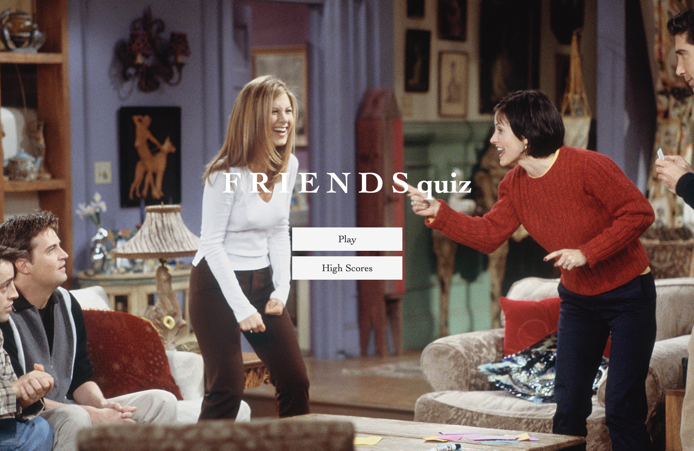
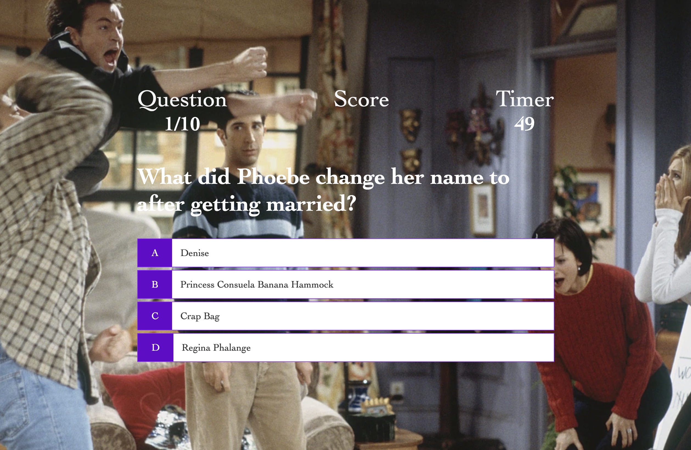
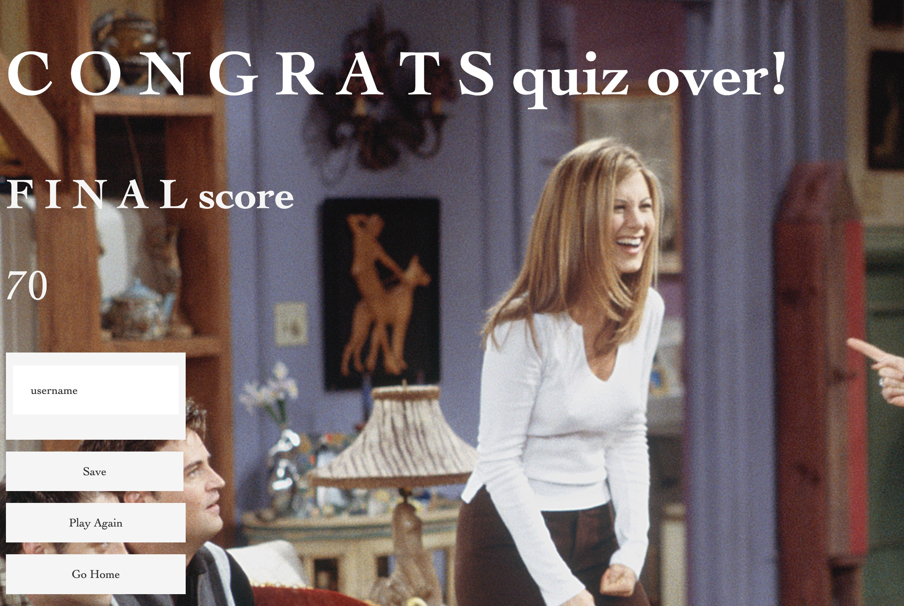
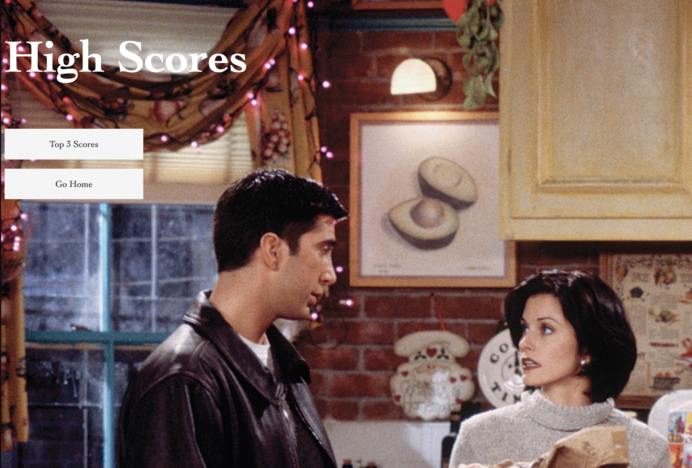

# API-timed-quiz
Create a timed quiz that stores high scores.
## Must Haves:
### GIVEN: I am taking a code quiz
- WHEN I click the start button
- THEN a timer starts and I am presented with a question
- WHEN I answer a question
- THEN I am shown with the next question
- WHEN all questions are answered or the timer reaches 0
- THEN the game is over
- WHEN the game is over
- THEN I am taken to a quiz over page that shows my score
- THEN I can add my username and save my score
- WHEN I navigate to high scores
- THEN I am can click on get scores to see the top 3 scores
 
https://vanessamald.github.io/API-timed-quiz/
 
 
</img>
</img>
</img>
</img>
